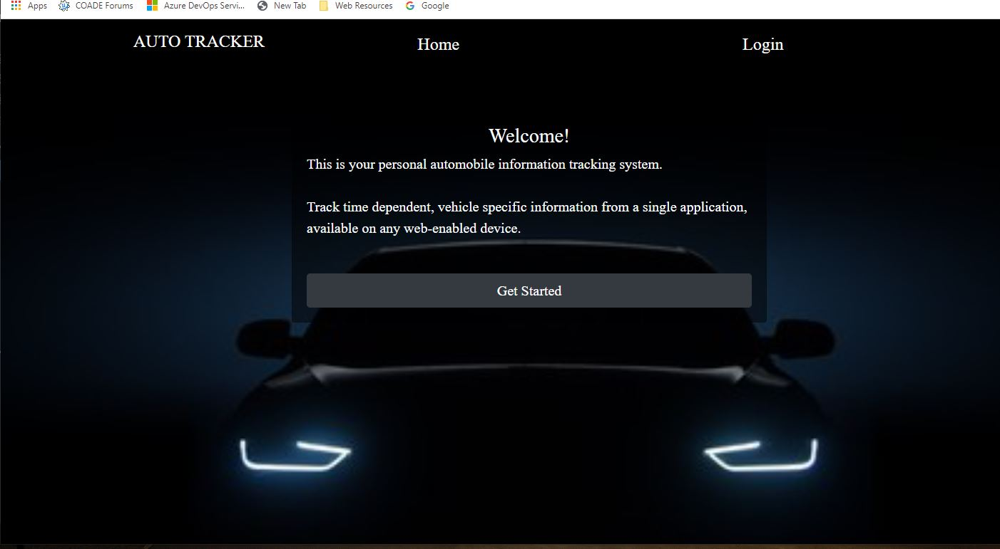

# Auto-Tracker Application

Group 3 Project, November 2020
(Richard Ay, Owais Islam, Lorena Kell, Cameron Wills)

## Table of Contents
* [Project Objective](#project-objective)
* [Acceptance Criteria](#acceptance-criteria)
* [Technologies Used](#technologies-used)
* [Auto-Tracker Logic](#auto-tracker-logic)
* [Important Links](#important-links)
* [Application Screen Shot](#application-screen-shot)

## Project Objective
As a family or organization with several automobiles, I would like an application that can maintain important information about each vehicle in a centralized location so I always have access to that information.  Ready access to registration and insurance expirations as well as the mileage for oil and tire changes will enable all my vehicles to be legal and safe.

## Acceptance Criteria
Given a number of vehicles and a number of drives:

1) When I start the application, I can login or register (sign-up) as appropriate.

2) When I am logged in, I am presented with the 'vehicle dashboard', where I can see 'cards' with a summary of each of the vehicles I am responsible for.

3) When on the vehicle dashboard, I can update the data for a selected vehicle, as well as add or delete a vehicle.

4) When I am logged in, I can access a 'driver dashboard' where I can add and delete drivers.

5) When I use the application on various devices (computer, tablet, phone) the display is responsive such that my experience and capabilities are the same (across all devices).

## Technologies Used
* The NPM package express.
* The NPM package express-session.
* The NPM package express-handlebars.
* The NPM package mysql2.
* The NPM package sequelize.
* The NPM package connect-session-sequelize.
* The NPM package dotenv (to hide environment variables).
* The NPM package bcrypt (for password encryption).
* The NPM package AWS SDK, Multer, Multer S3 (for image upload/retrieval).
* The NPM JEST (for unit tests).
* The bootstrap API.
* The NPM methodOverride package (so we can Update & Delete from HTML forms).
* The application images are stored on Amazon S3.
* The application is deployed on Heroku: https://team-3-auto-tracker.herokuapp.com/

## Auto-Tracker Logic
The application is designed according to the MVC architecture.  The database tables (maintaining the information related to vehicles and drivers)  and their relationships are setup in a \models folder.  The front-end (the user interaction pages) are setup in the \views and '\html templates' folders.  The tie (link) between the models and views is setup in the '\controllers\api' folders.  These controllers contain the routes for the CRUD (Create, Read, Update, Delete) database operations.

The user interface (the pages displayed) is developed using Bootstrap and Handlebars.  Bootstrap and media queries are used to obtain the responsiveness of the application. This enables the presentation window to resize according to the display area of the viewing device.  The Handlebars package is used to modularize the code and display the vehicle information, from templates utilizing partials where appropriate.  Data specific to a vehicle or driver is displayed modals.  Modals are also used to add vehicles and drivers.

## Important Links
The URL to the GitHub repository: https://github.com/p2T3/auto-tracker 
The URL to the Heroku deployment: https://team-3-auto-tracker.herokuapp.com/ 

## Application Screen Shot

